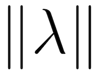

# Norm :: Neural Object Relational Models

We propose a neural logic programming language, Neural Object Relational Models (Norm), primarily for human experts 
conducting data analytics and artificial intelligence computations. Humans are taught to reason through logic while the 
most advanced AI today computes through tensors. Norm is trying to close the gap between human logic reasoning and 
machine tensor computation and to keep human experts in the loop. 

Norm expresses the world in higher-order-logic and compiles the logic program to neural network frameworks and 
distributed computation frameworks to take advantage of advanced algorithms and large-scale parallel computation. 
Norm takes an object-relational semantics to ground logic expressions into a directed factor graph. Deterministic 
logic reasoning follows the graphical structure and assigns each object a false or true value. Probabilistic 
computation follows the same structure but relaxes the binary value to a range between 0 and 1. The relaxation 
parameterizes the logic reasoning with a neural network which can be optimized through learning algorithms. 

Norm is suitable for bridging the collaboration between human experts and machine intelligence where people provide 
high-level cross-domain knowledge while machine provides specific in-domain optimization. Since the knowledge 
representation by logic is abstracted from the actual tensor computation, human experts will be able to hypothesize 
theories, fit and test them against data, and conduct counterfactual analysis without a deep understanding of 
how neural networks computing. We hope that Norm can enable more people to innovate in their own domains at
a much faster pace.

## Object Relational Semantics
The world is composed of an infinite number of 
objects where relations form directed edges among these objects. Each object is represented by both a symbol and a 
tensor. Each relation computes a probability value of the output object given the input objects. The logic computation 
produces 0 or 1 probability representing false or true value. The probabilistic computation produces a probability 
between 0 and 1 representing how likely the object is true. For each object, Norm assigns a label to indicate whether 
it is witnessed or not. Witnessed object is labeled as 1 or 0 for being positive or negative. Norm can construct 
objects with no witnessed label, i.e., na, due to the **open-world assumption** (OWA) that unknowns do not equal negatives. 
The probability computation of un-witnessed objects is called prediction. Otherwise, it is called interpretation. 
The quality of the interpretation can be measured based on how consistent probability values and label values,
 e.g., entropy or accuracy. These measures also drive parameter optimization through different learning algorithms.
  The statistical principles provide generalization guarantees for the prediction quality from the measured
   interpretation quality. Meanwhile, because the inference still follows the same semantics as human experts expressed, 
   people can understand the computation intuitively compared to a pure DNN architecture. This object-relational 
   semantics establishes a common communication protocol between human experts and machines
   
### Type, Relation and Predicate
A type declares a relation over a set of variables. For example,

    History(patient: Patient, record: String);
    
Here, `History` is a relation between a `patient` and a `record`. The keyword “History” is called the predicate. 
The above declaration can be read as A patient of type Patient has a medical history record of type String. 
Semantically, these three concepts are interchangeable in Norm.

An entity is a special relation whose variables are considered as attributes. For example,

    Patient(name: String, age: Integer);
    
### Object
Constants are objects, e.g. "Adam" and 34. Each object has a particular type. Each type refers to a set of such objects.
 The world is composed of objects. We assume an open world which contains an infinite number of objects where most of 
 them are unknowns.
 
A relation combines a tuple of input objects into an output object, e.g., `@Patient("Adam", 34)`. 
This is called grounding. In Norm, type itself can be grounded to a type-object, e.g., `@Patient`. 
Type-object has a generic type Type. See section for more details about Norm’s type system.
Every object has a unique id, _oid. We can refer to the object with the _oid or with the fully specified symbol.

However, a partially grounded type is not an object, e.g., `@Patient("Adam")` does not have a _oid associated with that symbol. 
Unlike in common databases where objects are allowed to be duplicated, Norm specifies that every object has a unique _oid. 
In this way, deduplication is automatically applied during the construction process.

### Variable
Variables are placeholders for objects. A Norm expression is first grounded to fill variables with objects, 
then infers the probability of these objects. Norm is a 3-valued logic where na denotes the unknown objects. 
In many cases, variable can take `na` objects.

### Type of variables
Every variable has a type which restricts the set of objects to select from. For example, name of Patient is a String. 
This implies that any string can be a person’s name. We use the symbol “:” to denote the isa relationship between a 
variable and a type.

### Scope of variables
A variable can belong to a type or another variable. For example,

    Patient.name;
    History.patient.name;

Accessing `name` in both cases are valid but their domains are different. `Patient.name` has the domain of names of 
every `Patient`, while `History.patient.name` only has names of all patients who have a medical record.
 
### Definition
Declaration of types informs the machine about the structure of types. For example, we know that History has a subset 
of objects from Patient. Definition informs the machine about the structure of objects. For example,

    Patient := "Adam", 34
             | "Adam", 5
             | "Adam", 11
             | "Joey", 9;
    History := @Patient("Adam", 34), "smoking"
             | @Patient("Adam", 5), "parents are heavy smokers"
             | @Patient("Adam", 5), "had a fever for 3 days";

Here, symbol “:=” denotes **means** relationship, and ‘|’ denotes **or** relationship. Examples above show the 
**extensional definition** that constructs objects and label them as positives. If a negative label is required, 
we can specify it at the end of each row, e.g., `Patient |= "Adam", 34, 0`. An **intensional definition** is a logical 
expression that can be evaluated to the extensional objects. 

At any moment, the full extensional definition of the world results in a factor graph.

Every type is represented by a box with different color. Every object is represented by a circle with the same color as 
its type. Input objects to the type have variable names on the label. The output object simply reflects the composition
 of input objects. Types like Integer or String are constant types without any inputs. Objects witnessed as positives 
 filled with color. Objects witnessed as negatives filled with gray but edged with color. Unknown objects are dark 
 matters in the world that might not be depicted in the graph.

### Expression
With the basic concepts of type, variable, and object, we can form logical expressions to validate a statement or infer 
variables. For example,

    // Any child less than 10 year old does not have a tobacco history
    forany p: Patient, p.age < 10 =>
         not exist r in p.History.record, r ~ 'smoke';
         
This is a first order logic expression, where symbol “=>” denotes **imply** relation, a.k.a., if … then.  
Symbol “~” denotes the **like** relationship. Any record evaluating to true is returned as a positive. 
Any record evaluating to false is returned as a negative. Any failed record is returned as exceptions or unknowns. 
For the given example, we have the following results where each object is listed as a row in the table. 
The variable _label represents the witnessed value while _prob represents the inferred value. 
Clearly, the negative object is a counter-example (false negative) that indicates the conflicts of given 
logic expression and the witnessed world. Domain experts can further investigate and modify hypothesis accordingly.
 
Positives:

| _oid      | p                    |r         |_prob   |_label |
|:--------- |:-------------------- |:-------- |:------ |:----- |
| $12faefe  | @Patient(“Adam”, 34) |“smoking” |1.0     |1      |
| $21feab   | @Patient(“Adam”, 11) |na        |1.0     |1      |
| $fa32b3   | @Patient(“Joey”, 9)  |na        |1.0     |1      |

Negatives: 

| _oid      | p                    |r         |_prob   |_label |
|:--------- |:-------------------- |:-------- |:------ |:----- |
| $a14aee   | @Patient(“Adam”, 5)  | “parents are heavy smokers” |**0.0** |**1**|

The graph representation of the logical path can be depicted in the following figure. The old world is grayed out to 
emphasize the newly added parts. 

Logic relations like '<', '~', not exist and '=>' take the input objects and compute the probability for the output 
object. For logic computation, the probability to be either a 0 or 1. For probabilistic computation, logic relation 
produces a probability between 0 and 1. For example, if we query the record by 'tobacco' instead of 'smoke', 
the '~' relation can produce a similarity measure to decide whether the record implies a “tobacco” history or not. 
This relation can be as simple as a cosine similarity or as complicated as a Transformer model. Norm utilizes a 
versioning mechanism to override relations for different definitions either deterministic or probabilistic. 
People can specify which version to use in the logic expression or rely on an auto machine learning algorithm to 
decide which version is the best to fit the witnessed world.

The actual implementation of the computation depends on the engine we use. 
For example, when data fit in memory, a python framework Pandas can be used to execute the computation. 
When data are distributed across multiple nodes, a python framework Dask can be used to push down the predicates. 
If GPUs are available, a python framework cudf can be used to run the expression. Of course, 
for the probabilistic computation, Norm compiles to tensorflow or pytorch. We will discuss the system in later section.

### Encapsulation
At last, a new type can be defined by removing the quantifiers.

    ChildNoSmoke(p: Patient, r: String) 
           := p.age < 10 => r !~ 'smoke';

This practice is called encapsulation which is a similar concept in Object Oriented Programming (OOP). 
Encapsulation not only modularizes the logic expression to reduce the overall code complexity, but it also factors out 
a lemma from the world. Other logic expressions can sign up the lemma without re-proving it. The more logic expressions 
depend on this lemma, the higher impact it is. These high impact in-domain or cross-domain lemmas will be the value of 
proposition. Lemmas can be invented by human experts and verified against data, or by machine intelligence and verified
by human experts. An effective and efficient interactive lemma invention is the key to facilitate the expert system.
