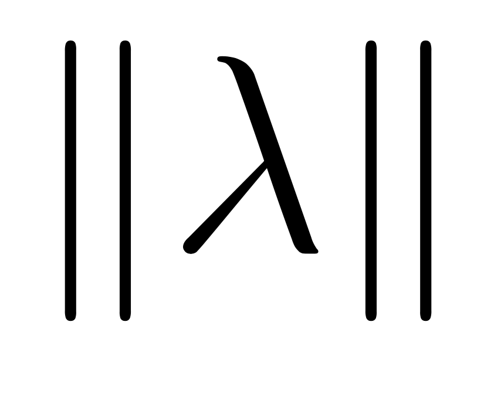

Neural Object Relational Models (Norm)
''''''''''''''''''''''''''''''''''''''''''''''''''''''''''''''''''''''''''''''''''''''''''''''''''''''''''''''''''''''''

Overview
=======================================

When human defines a concept, we mostly compose it with other concepts. Norm is such a
*Probabilistic Logical Programming* language that compiles to neural network
frameworks like Keras and PyTorch and enables high-level human-like reasoning.
*Deep Neural Networks* allows accurate and fast optimization with implicit contexts, while *Logical Programming*
allows abstract modeling by human understandable language. Norm marries them together to provide a powerful neural
logical programming experience.

For example:

.. image:: _static/jaywalk.png
    :scale: 10%
    :align: center

.. code-block:: prolog

    JayWalk{p: Person, r: Road} :-
        WalkAcross(p, r) & !(On(p, ?z) & ZebraCross(z))

Jaywalk is a new concept that we need to detect for Autonomous Driving Vehicle. Supervised deep learning approach
requires significant labeling efforts to build a high-quality dataset which can be expensive. Existing transfer learning
approach allows us to use intermediate layers of a network built for other concepts to fit JayWalk. However,
this does not work well if other concepts do not share common aspects or the new concept involves complicated relations
with others. With Norm, one can compose a new concept intuitively even without knowing how neural networks
work under the hood.

Norm is focusing on delivering the following features:

- **Compositional**:
    Human language is fundamentally compositional that can model complicated problems. Norm follows
    the :math:`\lambda`-**calculus** to support not only propositional logic but higher order logic.
    Each logical function in Norm is a neural network module, so any composed function compiles to a
    neural network as well.
- **Conversational**:
    Every theory fails on certain conditions. Human corrects the failure through reasoning. Because Norm is a human
    understandable language, we can see the explanation, critic the logic, propose new theories, query data to verify
    and eventually prevent the same failure in the future.
- **Statistical**:
    The deterministic logical program is well-known to be brittle and difficult to scale, so Norm adopts the machine
    learning methodology like Deep Neural Networks to maintain the robustness and the generalizability.

Contents
=======================================

.. toctree::
    :maxdepth: 2

    language
    interaction
    neuralnet
    application

Indices and tables
------------------

* :ref:`genindex`
* :ref:`modindex`
* :ref:`search`

