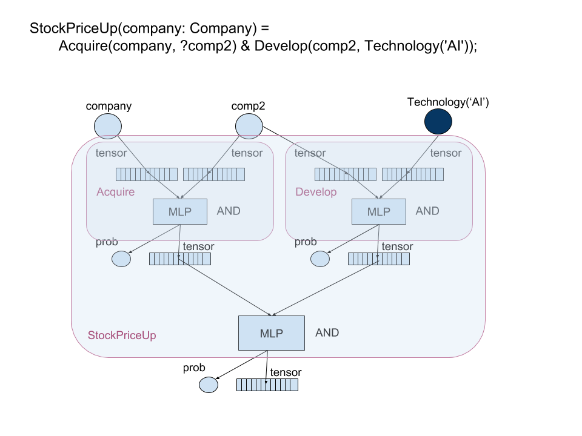

Neural Networks
====================================

In deterministic logic programming, inference is a hard decision. When the logic gets more and more complicated, it
becomes extremely sensitive and brittle. In addition, the conventional logic programming paid more attention to
the context-independent logic in hope that the theorem can be generalized in any situation. This is a rather strong
claim and usually does not hold for real applications. Context-dependent has been proven to be an important complimentary
to symbolic representations. For example, word2vec encodes the context information into a vector for each symbol and has
improved many NLP and text related tasks.

Norm is designed to combine the advantages of both symbolic and numerical representations together,
i.e., **compositional** and **contextual**.

Relation expression
----------------------------
Any relation can be grounded as one neural network like the following example.

In this example, circle represents a free or unobserved variable, and dark circle represents a constant or observed
variable. We simply considers ``AND`` as a Multi Layer Perceptron (MLP) that projects a concatenated vector into a
lower dimensional vector with a probability as binary entropy. The tensor out of the MLP is a hidden layer mostly.

Training
----------

This shows how to train a function

Sampling
----------------

Weak/distant supervision
--------------------------

Active learning
-------------------

Debugging
-------------------

Indexing
----------

